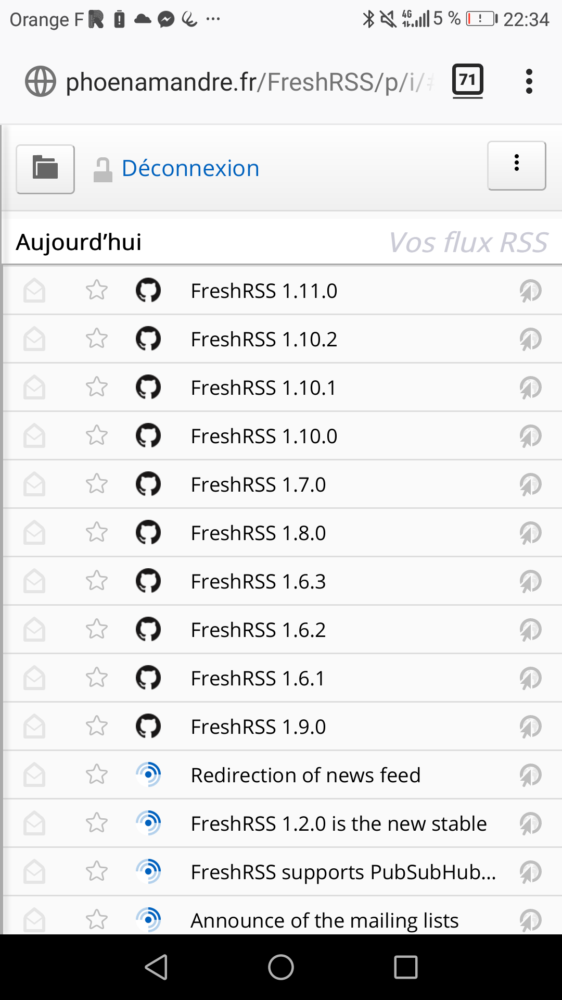
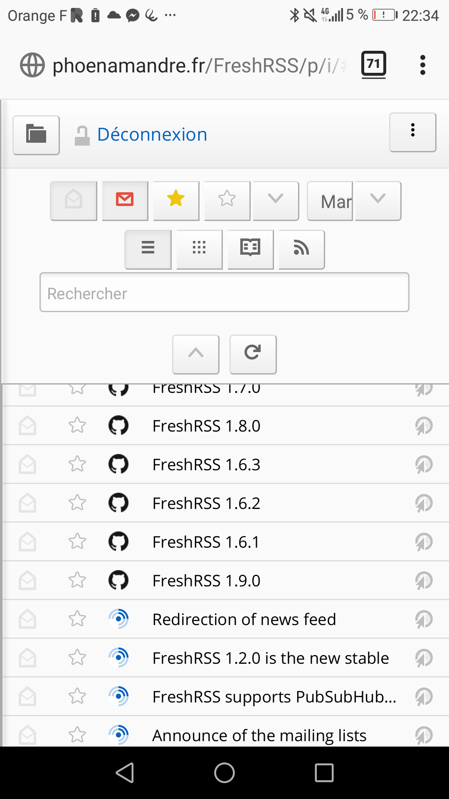

# FreshRSS Androidify
Minimizes the required button space and groups buttons, inspired by      https://github.com/oyox/FreshRSS-extensions/tree/master/xExtension-SmartMobileMenu

# Screenshot:

# Installation
To use it, upload the *xExtension-Androidify* folder in your ./extensions directory and enable it on the extension panel in FreshRSS.